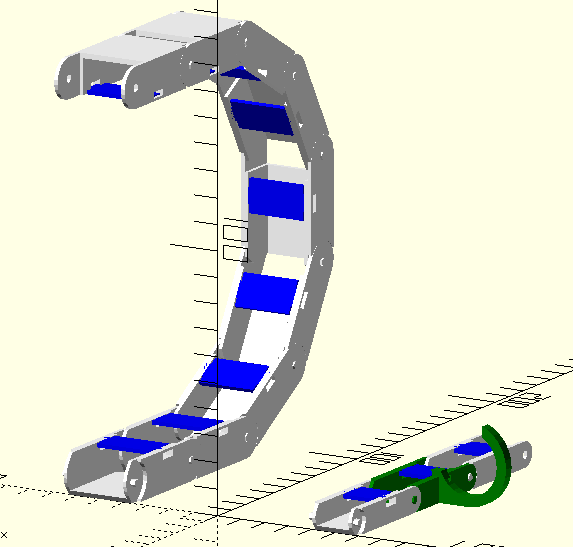

= 3d printed cable chain
:openscad_lib_name: cable_chain

This library contains generator of a 3d printable easy to assemble cable chain with optional segments with a hook (useful to attach external flexible hose/tube).

This library depends on https://github.com/nophead/NopSCADlib[NopSCADlib] and can be used as a git submodule in NopSCADlib styled CAD projects:

== Installation

Clone git repository as submodule to your OpenSCAD project. Assuming that external deps are placed to `lib` directory.

[source,bash,subs=attributes+]
----
git submodule add https://github.com/eraga/openscad_{openscad_lib_name} lib/{openscad_lib_name}
----

== Example usage

[source, openscad, subs=attributes+]
----
include <../lib/{openscad_lib_name}/{openscad_lib_name}s.scad>

translate([-50,0,8])
cable_chain(SAMPLE_CABLE_CHAIN, [0,0,30,30,30,30,30,30,0]);
translate([50,0,5])
cable_chain(SAMPLE_CABLE_CHAIN_WITH_HOOKS);
----
